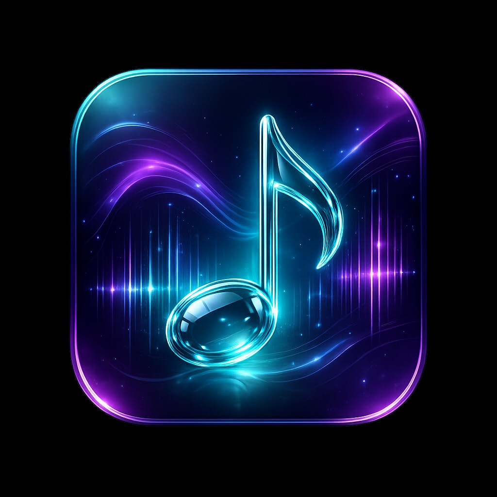

<p align="center">
  
</p>

<h1 align="center">AudioPlayer</h1>

<p align="center">
  A modern, neon‑styled offline music player for Android.<br />
  Jetpack Compose · Material 3 · ExoPlayer / Media3 · Material You dynamic colors.
</p>

<p align="center">
  
  
  
  
  
</p>

---

## Why this player

The app is built for listeners who keep their music on the device: audiobooks,
local rips, podcasts, voice notes. It focuses on three things the defaults
still get wrong on modern Android:

- **It remembers exactly where you left off** — track + position + queue
  survive process death, swipe‑kill and storage permission revocations.
- **It deletes files properly** — single tracks and whole folders go through
  one system confirmation, then disappear from the UI immediately (no stale
  rows, no silent failures on Android 11+).
- **It reads legacy tags** — Russian / Ukrainian / Turkish audio files with
  Windows‑1251 or Latin‑1 mojibake are decoded on the fly via a scoring
  heuristic, so `Р"Р»Р°Р°Р²Р°` finally reads as `Глава`.

## Features

### Library
- All songs, albums, artists, album artists, composers, lyricists, genres,
  playlists and a natural‑order file‑tree browser.
- Smart lists: recently added, recently played, most played, favourites.
- Global search across every tab.
- Blacklist tracks or entire folders without deleting them from disk.
- Sorting profiles remembered per tab (title / album / artist / year / duration).

### Playback
- Background playback via a `MediaSessionService` (ExoPlayer under the hood)
  with rich notification controls (prev / play‑pause / next / favourite / close).
- Now‑playing screen with seek slider, queue reorder & drop, repeat‑off /
  repeat‑all / repeat‑one, shuffle, headset autopause.
- Persisted queue + position with DataStore: the last track always resumes
  exactly where it stopped.
- Speed / pitch playback params (preserving pitch via Sonic).
- Volume booster up to 200 % via a custom PCM gain audio processor.
- 5 / 10‑band equalizer, bass boost, virtualizer, preset reverb.
- Sleep timer (minutes or "stop after current track").
- Crossfade‑friendly skip logic: Next / Prev respect repeat‑one and queue
  size semantics.

### Editing & tagging
- In‑app tag editor: title, album, artist, genre, track number + embedded
  cover art pick / replace / remove (via JAudioTagger).
- Read path falls back onto UTF‑8 / Windows‑1251 decoding when the file
  advertises ISO‑8859‑1 but contains mojibake bytes.
- Rename folders on disk and reflect the change in library listings without
  re‑scanning the whole MediaStore.

### Files
- Delete single tracks or whole folders through the modern
  `MediaStore.createDeleteRequest` flow — one system prompt per action,
  both on Android 10 (`RecoverableSecurityException`) and Android 11+.
- Folder listings refresh instantly after deletion; if you were inside the
  deleted folder, the explorer walks up to the nearest living parent.

### Extras
- Built‑in dictaphone (record m4a voice notes into `Music/AudioPlayer/Dictaphone`).
- 11 home‑screen widget styles (Glance‑based), pinnable at runtime.
- Custom crash activity + Timber + Firebase Crashlytics breadcrumbs.
- Backup & restore of playlists / preferences.

### UI
- Full‑screen dynamic splash (cinematic icon + orbiting neon glows +
  shimmering gleam + iridescent cyan↔magenta↔indigo tint).
- Consistent library gradient (blue → violet → magenta) across Home,
  Collections, Tag editor, Volume booster, Dictaphone, Widgets.
- Shared styled snackbar (indigo pill with cyan accent stripe) for every
  status message in the app.
- Material You dynamic colors on Android 12+, curated accents on older
  devices, optional AMOLED variant.

---

## Screenshots

Marketing screenshots live in [`branding/`](branding/). The launcher icon
shown above is the source asset in [`branding/app_icon.png`](branding/app_icon.png);
regenerate the mipmap set at any time with
[`branding/generate_launcher_icons.ps1`](branding/generate_launcher_icons.ps1).

---

## Build & run

```bash
git clone https://github.com/volkrist/generic-audioplayer.git
cd generic-audioplayer
./gradlew installDebug
```

- **JDK 17** is required (configured via Android Gradle Plugin 8.x).
- Android Studio Hedgehog / Iguana or newer works out of the box.
- On first launch the app will ask for `READ_MEDIA_AUDIO`
  (`READ_EXTERNAL_STORAGE` on API ≤ 32) and `POST_NOTIFICATIONS`.

To regenerate all launcher icons from the source PNG:

```powershell
powershell -ExecutionPolicy Bypass -File branding/generate_launcher_icons.ps1
```

---

## Architecture

| Layer | What's in it |
|---|---|
| **UI** | Jetpack Compose + Material 3, one `ComposeView` per `Fragment`, shared `AudioPlayerTheme` + `HomeLibraryTokens` for the gradient. |
| **State** | `ViewModel`s scoped to the Activity (library) or Fragment (tag editor, dictaphone, etc.), exposing `StateFlow` / `SharedFlow` streams. |
| **Playback** | `AudioPlayerService` (`MediaSessionService`) owns the singleton `ExoPlayer`; `QueueService` exposes a mirrored queue, `PlayerService` wraps service lifecycle + debounced play/pause. |
| **Persistence** | Room for library metadata + playlists, DataStore (proto) for queue snapshot and user preferences. |
| **DI** | Hilt across ViewModels, services, managers. |
| **Tags** | JAudioTagger for read/write; `maybeFixMojibake` heuristic applied at the boundary between file bytes and display strings. |

---

## Tech stack

- Kotlin · Coroutines · Flow
- Jetpack Compose · Material 3 · Material You dynamic colors
- Media3 (ExoPlayer) · MediaSessionService · Glance widgets
- Hilt · Room · DataStore (Proto)
- Coil · Accompanist · Lottie
- JAudioTagger · Sonic
- Timber · Firebase Crashlytics · LeakCanary · MockK
- Protocol Buffers · WorkManager · Navigation Component

---

## License

Released under the [MIT](LICENSE) license.
